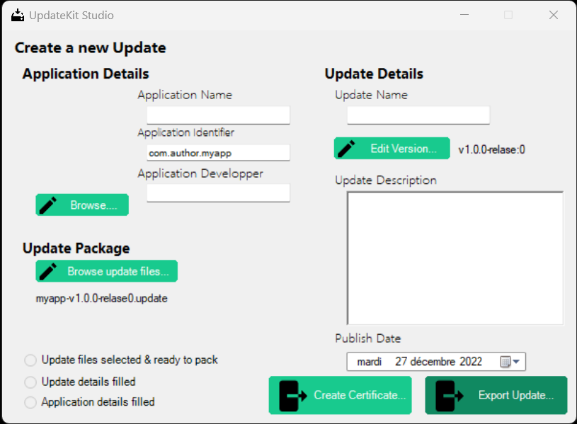

<h1 align="center">UpdateKit</h1>

  UpdateKit est un programme de mise a jour pour vos applications en C#

  Avec UpdateKit, plus besoin de créer un logiciel de mise a jour, implémentez UpdateKit dans vos projets et il se charge de tout.

<h2 align="center">UpdateKit Studio, Déployez vos mise a jours facilement</h2>

UpdateKit Studio se charge de tout, indiquez-lui les informations de votre mise a jour, le dossier qui contient les nouveaux fichier et tada, il vous exporte un package de mise a jour que vous pouvez herberger. Il vous suffit de le mettre en ligne, modifier le fichier JSON qui est donné avec le package avec l'url de téléchargement direct et c'est tout. Vos utilisateur receveront une boite de mise a jour lors de l'ouverture de votre application

 

<h2 align="center">Et le code source ?</h2>

UpdateKit est open-source, le code est sous, licence MIT. Je le publirai quand j'aurai réglé quelques bugs et que j'aurai optimisé l'installation des MaJ. Cela sera en même temps que AltDirecte, qui sera la 1ere application qui utilisera ce systeme de mise a jour.

<h2 align="center">Quels améliorations prévue ?</h2>

Pour la version v2.0.0, je prévois de faire des optimisation, des nétoyages et grandement améliorer UpdateKit Studio. Vous pourrez créer des projets pour plus facilement des mise a jours, UpdateKit Studio remplira les informations et autres. Il gardera aussi un historique des versions et des changements. Pour voir tout les changements prévu, consultez la roadmap dans l'onglet projets

